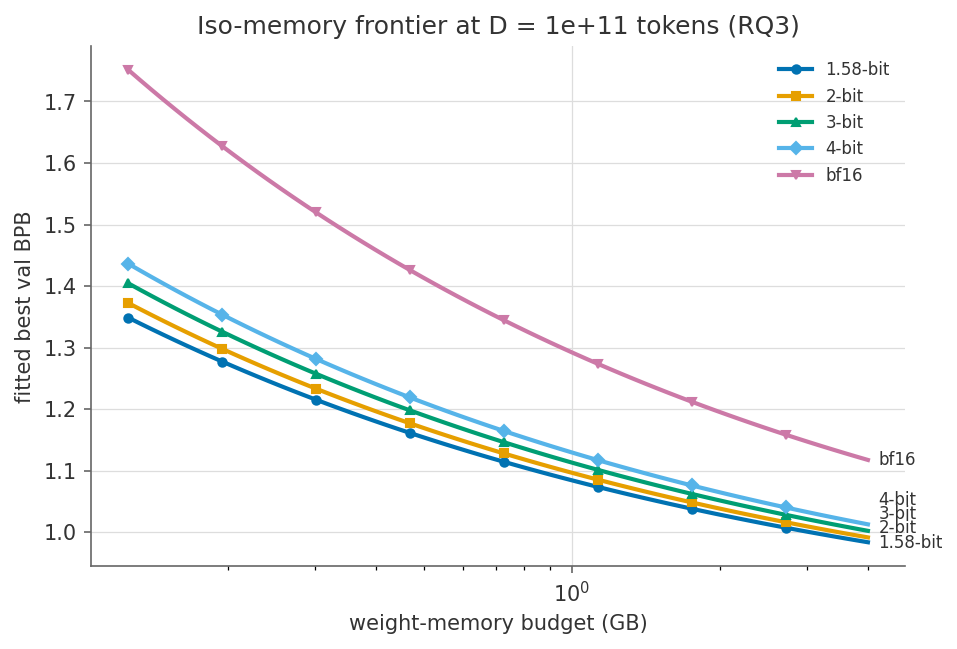
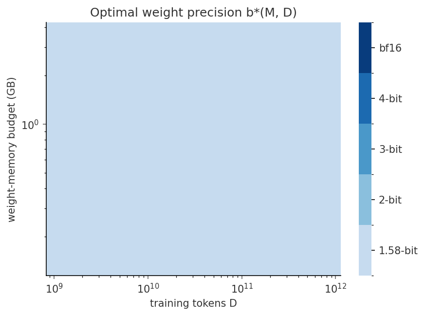

# LOGOS · memory-optimal scaling laws for natively low-bit LLMs

## Why this exists

**The binding constraint on AI is shifting from FLOPs to bytes — and the
industry's standard answer to that, post-hoc quantization, is a patch, not a
solution.**

The supply side first, because it is not a hypothetical. As of 2026, memory
is the bottleneck of the AI buildout: hyperscalers have committed roughly
[$600–630B of 2026 capex](https://alcapitaladvisory.com/research/intelligence/ai-infrastructure.html),
and memory alone has grown from ~8% of that spend in 2023–24 to
[~30% in 2026](https://www.digitaltoday.co.kr/en/view/45884/memory-to-account-for-30-percent-of-hyperscalers-capex-in-2026-on-ai-demand).
The three DRAM makers are diverting wafers to HBM (one HBM3E module sells for
~10× the equivalent DDR5), datacenters are absorbing
[~70% of world memory output through 2027](https://wccftech.com/roundup/memory-crisis/),
server DRAM contract prices [jumped ~60–90% in a single quarter](https://www.idc.com/resource-center/blog/global-memory-shortage-crisis-market-analysis-and-the-potential-impact-on-the-smartphone-and-pc-markets-in-2026/),
HBM backlogs run [about a year](https://valueaddvc.com/blog/is-the-ai-chip-shortage-over-in-2026-gpu-pricing-and-what-comes-next),
and supply-side voices range from Intel's "normal by 2028" to SK Hynix
[warning the crunch could outlast the decade](https://tech-insider.org/memory-chip-shortage-2026-ai-consumer-electronics/).
2026 DRAM bit supply grows ~16% against AI demand that can absorb all of it.
Every byte a model needs — weights in HBM, KV cache per user, DRAM in the
phone or laptop it ships to — is getting scarcer and more expensive, and
this is a multi-year structural condition, not a cycle blip.

Against that backdrop, look at how the field actually handles memory:
**train in 16-bit, then quantize the artifact afterward.** Post-training
quantization treats precision as a deployment afterthought, and it is not a
sustainable answer for three reasons:

1. **It falls off a cliff exactly where the byte savings matter.** PTQ holds
   up at 8 and 4 bits and degrades sharply below — the regime where a 4×–10×
   footprint reduction actually lives is the regime it cannot reach.
2. **It changes nothing upstream.** You still pretrain the full-precision
   model on the full-precision memory bill; the scarce resource is spent
   before compression ever happens. A patch applied after training cannot
   fix the economics of training.
3. **It optimizes the wrong objective.** Squeezing a model designed for 16
   bits into 4 asks "how little damage can we do?" The right question is
   "what is the best model that *fits the byte budget in the first place*?"
   — and evidence keeps accumulating (BitNet, ParetoQ, Spectra) that models
   *trained* low-bit from scratch answer it better than models patched down
   to low-bit.

If bytes are the scarce resource, compression has to move **into
pretraining** — new ways of training, not post-processing. But native
low-bit training is missing its design rule. Chinchilla told the field how
to split a *compute* budget between parameters and tokens; nobody has
published the deployment version: **given a memory budget in bytes, how do
you allocate parameter count (N), weight precision (b_w), KV-cache precision
(b_kv), and training tokens (D) to maximize quality?**

That law is what LOGOS fits — empirically, for QAT-from-scratch BitNet-style
models, across five weight precisions (1.58 / 2 / 3 / 4 / bf16 bits) — then
validates by **blind extrapolation** (predictions committed to this repo
before the validation runs launch) and cashes in as a prescription: the
crossover map of where *more parameters at fewer bits* beats *fewer
parameters at more bits*. The model suite is named **TRIT** (one trit = one
base-3 digit = 1.58 bits).

There is a second argument baked into the method: this is a solo,
self-funded program designed to run on consumer hardware — the grid fits on
a single desktop GPU, with **≤ $100** of cloud compute reserved exclusively
for the extrapolation anchors. In a world of allocation-gated H100s, showing
that a real scaling law can be fitted, validated, and released from one desk
is itself part of the point: the same byte-scarcity that motivates the
research also rations who gets to do research, and memory-optimal training
is one of the few ways around both.

- 📋 Research plan: [v0.3 — LOGOS-Local](research/logos-research-plan-v0.3-local.md) (active) · [v0.2 — full-scale program](research/logos-research-plan-v0.2.md) (reference design)
- 🧪 Research notes: [0 — micro-scale replication](docs/research-note-0-micro-p0.md) · [1 — the L0 crossover](docs/research-note-1-l0.md) · [2 — L1 protocol freeze](docs/research-note-2-l1-protocol.md) (in progress)
- 🔍 External review: [kimi3 round 1](docs/kimi3-research-review-round-1.md)
- 🧰 Methods: [methodology.md](docs/methodology.md)
- ✅ Verification: [validation panel, round 1 report](docs/validation-panel-round-1.md) — 11 falsifiable probes, 49 sha256-locked kill gates

---

## First result (micro-P0, replication tier)

Full precision ladder trained end-to-end on real text at micro scale
(~4.7M non-embedding params, byte-level, RTX 3080):


| Arm | Val BPB (mean) | Packed body | vs bf16 |
|-----|---------------|-------------|---------|
| ternary (1.58-bit) | **2.683** | 1.36 MB | −0.014 BPB, within noise |
| 2-bit | 2.733 | 1.55 MB | |
| 3-bit | 2.630 | 2.15 MB | |
| 4-bit | 2.671 | 2.75 MB | |
| bf16 | 2.697 | 9.77 MB | |

In the deeply undertrained regime (D/N ≈ 0.9), **ternary matches bf16 at 7.2×
smaller packed footprint** — reproducing the known qualitative dynamic
(Ouyang et al.: low-bit favors undertrained models) that the main grid will
map quantitatively along the tokens/param axis up to 320×. Gap verdicts are
gated by a 2σ seed-noise discipline enforced mechanically by the results
store. Details and caveats: [Research Note 0](docs/research-note-0-micro-p0.md).

## The program at a glance

| Phase | Question | Where | Cost |
|-------|----------|-------|------|
| L0 | Does our stack reproduce known ternary-vs-bf16 dynamics, and what is the seed-noise floor? | RTX 3080, now | $0 |
| L1 | How does the low-bit gap evolve with tokens/param (20×→320×)? | 3080 → 5090 | $0 |
| L2 | The law: L(N, D, b_w) over 3M–60M × 5 precisions; iso-memory frontier; b*(M, D) phase diagram | RTX 5090 | $0 |
| L3 | Does the law predict 125M *before* we train it? (blind, timestamped) | RunPod 1×H100 | **≤ $100** |
| L4 | When does the KV cache dominate the byte budget? | local, mostly eval | $0 |
| L5 | Does the law's prescribed model beat same-footprint baselines? (**trit-lite**) | RTX 5090 | $0 |

~830 local GPU-hours total. Everything is manifest-driven: all ~145 runs are
pre-specified in [`manifests/`](manifests/) with per-run cost estimates, and
nothing launches by hand twice.

## How the claims stay honest

1. **One variable moves at a time.** Architecture, tokenizer, data, data
   *order* (`data_seed=1337` project-wide), optimizer, and schedule are frozen
   across arms; the linear-layer precision (and its P1-measured LR multiplier)
   is the only difference.
2. **N means non-embedding parameters**, and byte budgets at this scale are
   body-byte budgets — the tied 32k bf16 embedding is reported separately and
   dominates small artifacts (84% of a ternary 25M export). Stated everywhere.
3. **Loss (bits-per-byte) is the fitting target; benchmarks are the
   validator.** Two disjoint held-out sets.
4. **No gap is claimed below 2σ** of its size class's measured seed noise.
5. **Fit forms compete** (effective-capacity vs additive-degradation), selected
   by leave-one-size-out extrapolation — never in-sample fit.
6. **A separate validation panel** re-derives every load-bearing quantity from
   first principles (independent numpy quantizer implementations, hand-derived
   STE gradients, an independent bit-stream unpacker, hidden-ground-truth fit
   recovery) behind pre-registered, sha256-locked kill gates. Round 1 caught
   6 real defects before any result was published: [report](docs/validation-panel-round-1.md).

Illustration of the fitting machinery on synthetic ground truth (the demo
recovers hidden law parameters within 4%; real-data versions of these figures
land with L2):

| Iso-memory frontier (demo) | b*(M, D) phase diagram (demo) |
|---|---|
|  |  |

## Repository map

| Path | What |
|------|------|
| `src/logos/config.py` | The frozen contract: precision ladder, model shapes (3M–1.5B), run specs with science-bearing config hashes |
| `src/logos/quant/` | BitLinear (ternary absmean, per BitNet b1.58) · ParetoQ-style 2/3/4-bit per-group LSQ · WxA8 activations · STE |
| `src/logos/model/` | Llama-style decoder: RMSNorm, RoPE, GQA 4:1, tied embeddings, subln on quantized arms, optional KV-QAT |
| `src/logos/data/` | FineWeb-Edu → uint16 shards; deterministic fixed-order loader with exact resume |
| `src/logos/train/` | Spot-hardened trainer: atomic checkpoints, SIGTERM handling, bit-exact resume, grad accumulation, divergence kill |
| `src/logos/eval/` | Bits-per-byte runner · pinned lm-eval-harness wrapper |
| `src/logos/export/` | Packed formats (i2_s ternary, exact-width int) · `.lpack` artifacts · GGUF hook · bitwise parity gates |
| `src/logos/fitting/` | Forms A/B/C · Huber-on-log multi-start L-BFGS · LOSO selection · bootstrap CIs · prescriptions & figures |
| `src/logos/manifest/` | Versioned run manifests (P- and L-series) · queue launcher · hard-capped budget ledger |
| `ops/` | KAOS agent tiers (monitor / eval / launcher) with audit journal, plus cron fallbacks — agents run the toil, humans run the experiment |
| `validation/` | The falsifiable-probe panel (`logos-validate --all`) |
| `docs/` · `research/` | Research notes, methodology, plans, figures |

## Reproduce

```bash
git clone https://github.com/canivel/logos && cd logos
uv venv --system-site-packages && uv pip install -e ".[dev]" --no-deps

python -m pytest -q                          # ~100 unit tests
python -m validation.panel --all             # the full verification round
python scripts/local_p0.py                   # micro-P0 on real text (~5 min on a GPU)

# the real program
python -m logos.cli data prepare --out data/fineweb_edu_10bt \
    --dataset-config sample-10BT --tokenizer TinyLlama/TinyLlama_v1.1 \
    --target-tokens 2500000000
python -m logos.cli train --manifest manifests/l0.yaml \
    --run-id 3m-1.58-tp20-s0 --data-dir data/fineweb_edu_10bt --runs-dir runs/l0
```

## Status

- [x] Full stack implemented and unit-tested (~100 tests)
- [x] Validation panel round 1: 11/11 probes ACCEPT
- [x] Micro-P0 replication on real text (this page's figure)
- [x] FineWeb-Edu 2.5B-token pretokenized corpus
- [ ] L0 grid on the 3080 (running)
- [ ] L1–L2 on the incoming RTX 5090
- [ ] L3 blind anchors → arXiv preprint
- [ ] L4–L5 → trit-lite + TRIT-Local suite on Hugging Face

## References

BitNet b1.58 (Ma et al. 2024; 2B4T report 2025) · ParetoQ (Liu et al. 2025) ·
Precision scaling laws (Kumar et al. 2024) · Low-bit favors undertrained
(Ouyang et al. 2024) · Spectra (Kaushal et al. 2024) · Chinchilla (Hoffmann
et al. 2022) · Ops layer: [KAOS](https://github.com/canivel/kaos)

Apache-2.0 · Danilo Canivel ([@canivel](https://github.com/canivel)), 2026
