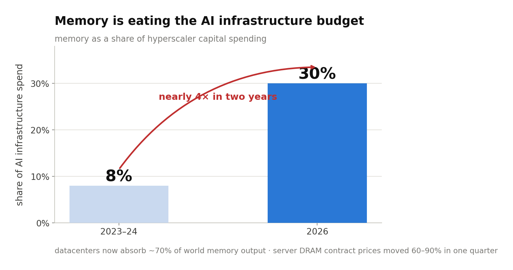
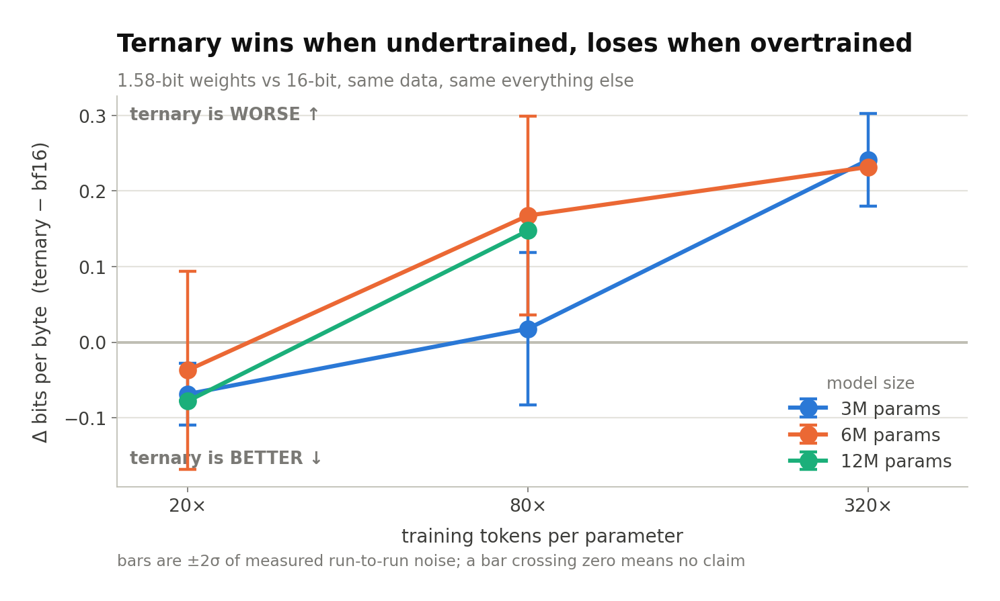
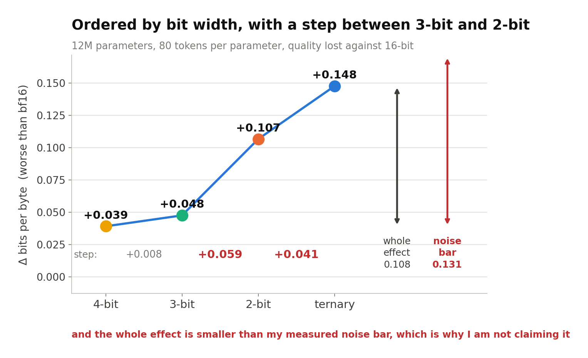
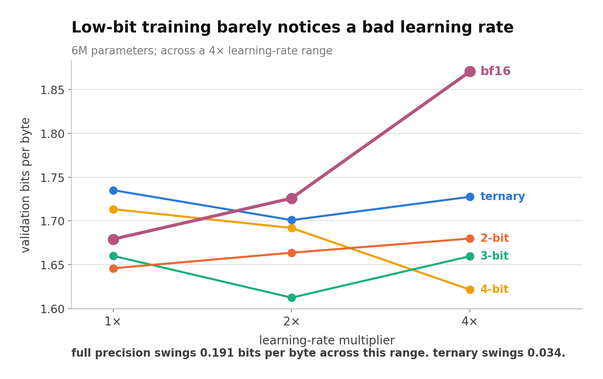

# everyone is worried about GPUs. the real shortage is memory

*so i started training language models at 1.58 bits per weight on a gaming GPU. 73 runs in, here is what i found and the one thing i cant claim yet*

---

---

everybody is talking about the GPU shortage. i think that is already the old story.

look at where the money actually went in 2026. the big five are putting something like 600 to 630 billion into capex, and memory went from around 8% of that spend in 2023 and 2024 to about 30% now. datacenters are absorbing roughly 70% of the world's memory output. server DRAM contract prices moved 60 to 90% in a single quarter. bit supply is growing about 16% against demand that would eat all of it.

when it normalizes depends who you ask. Intel says 2028. SK Hynix has said it could run past 2030.

*memory went from about 8% of hyperscaler infrastructure spend to about 30% in two years*

so the constraint moved. it is not how many FLOPs you can buy anymore, it is how many bytes you can hold. and that changes what question you should be asking about your model.

## the standard answer is a patch

what does everyone do when a model doesnt fit? train it in 16 bit, then quantize it after. squeeze 16 bits down to 4, get the file 4x smaller, ship it.

it works. i use it. but i dont think it is the real answer, for three reasons.

first, it falls apart right where the savings get interesting. post training quantization holds up fine at 8 bits, usually fine at 4, and then degrades fast below that. the regime where you actually get an 8x or 10x reduction is the regime it cant reach.

second, it changes nothing about training. you still paid the full precision memory bill to train the thing. compressing the artifact afterwards does not touch the economics of producing it.

third, and this is the one i keep coming back to, it optimizes the wrong thing. squeezing a model that was designed for 16 bits into 4 is asking "how little damage can we do here". the better question is "what is the best model that fits in this budget in the first place".

those are not the same question and they do not have the same answer.

## so what is the actual question

Chinchilla told us how to split a compute budget between parameters and tokens. roughly 20 tokens per parameter, and that reshaped how everyone trains.

nobody published the deployment version of it. that one goes like this:

**given a fixed number of bytes at inference time, how do you split them between parameter count, weight precision, KV cache precision, and training tokens, to get the best model?**

that is the question i am trying to answer. i wrote up the full framing in [chapter 9 of the book](https://canivel.github.io/logos/09-the-question.html) if you want the long version.

the intuition is simple enough. at a fixed byte budget, going from 16 bit to ternary lets you hold about 10x more parameters. if each of those parameters was as useful as a 16 bit one, low precision would always win. they are not as useful. so there is a peak somewhere, and where that peak sits is the whole thing.

---

---

## what i actually built

i dont have a cluster. i have an RTX 3080 with 10GB and about 100 dollars of cloud budget that i am saving for one specific experiment.

so the whole program is designed around that. 125 training runs, all pre specified in versioned manifests, draining on one card, chained so the GPU never sits idle between phases. every result carries a hash of the exact config that produced it. it is all public.

- the code and every result: [github.com/canivel/logos](https://github.com/canivel/logos)
- the long explainer, 15 chapters, written for someone with basic deep learning knowledge: [canivel.github.io/logos](https://canivel.github.io/logos/)

i wrote the book part because i kept explaining the same concepts to people and figured i should just write it down properly. it starts from what a token is and goes to fitted scaling laws. if you want the machinery tour, [chapter 11](https://canivel.github.io/logos/11-building-the-machine.html) is the one.

## the finding

here is the thing i did not expect to be so clean.

train a small model for about 20 tokens per parameter, which is roughly the compute optimal point, and the ternary model beats the full precision one. ternary meaning every weight is just -1, 0 or +1. 1.58 bits each.

keep training the exact same models out to 320 tokens per parameter and the ordering flips hard.

at 3M parameters:

• 20 tokens/param: ternary is **0.069 bits per byte better** than bf16, past the 2 sigma bar of 0.041
• 80 tokens/param: +0.018, inside the noise, no claim
• 320 tokens/param: ternary is **0.241 worse**, four times the bar

so the answer to "which precision should i use" is not a constant. it is a crossover. and it matters because every model anyone actually deploys lives way out on the right side of that curve, in the overtrained regime.

i have now reproduced this at 3M, 6M and 12M parameters. at 12M and 20 tokens/param, all four quantized arms beat full precision.

*below zero means ternary is winning. the bars are two sigma of measured run to run noise, so anything crossing zero is not a claim*

## the part i cant claim

this is the bit i find more interesting than the result.

last week the 12M row at 80 tokens per parameter finished with all five precisions in it. deficit against full precision:

• 4 bit: +0.039
• 3 bit: +0.048
• 2 bit: +0.107
• ternary: +0.148

perfectly ordered by bit width. and look at the spacing. from 4 bit to 3 bit is 0.009. from 3 bit to 2 bit is 0.059. more than six times bigger. the arms group into two clusters instead of sliding smoothly.

*the two arrows on the right are the whole effect and my measured noise bar, at the same scale. that is the reason i am not claiming any of it*

that shape has a name already. ParetoQ described a transition between a reconstruction regime at 3 bits and up, where the model can still approximate the weights full precision would have found, and a compensation regime at 2 bits and below where it has to find a genuinely different solution. they saw it quantizing trained models. this looks like the same boundary showing up in models trained low bit from step one.

nice story. i am not claiming it.

every one of those runs is a single seed. the whole spread from 4 bit to ternary is 0.109 bits per byte, and my measured noise bar at the size below is 0.131. so the 0.059 step that the entire story rests on is not even individually claimable. and a perfect ordering of four things comes up 1 time in 24 by chance, and i noticed it after looking, which is exactly the situation where people fool themselves.

i had three options. claim it anyway. spend about 32 GPU hours adding seeds to shore up one cell. or write down in advance exactly what would have to be true and let runs that were already scheduled decide it.

i took the third one. [the prediction is committed with a timestamp](https://github.com/canivel/logos/blob/main/predictions/2026-08-11-bit-regime-step.md), three specific falsifiable calls for the 25M and 60M rows, written before either started training. six binary outcomes. five or six hits and it is worth spending seeds to nail down. two or three and it is dead.

only that option costs nothing and can actually be wrong.

## why i keep going on about noise

if there is one thing i would want someone to take from this whole project it is this.

train the same config twice with a different random seed and you get a different number. at the sizes i am working at, that spread is between 0.006 and 0.066 bits per byte depending on the cell. a lot of quantization results i read online are smaller than that.

so the rule in this project is that no quality gap gets claimed unless it clears two sigma for its size class. about a third of my measured comparisons come back as "inside the noise, no claim". that feels bad to write and it is the correct thing to write.

i also had to retract one of my own claims already. i had written that the low bit deficit grows with model size, which was true of the two sizes i had at the time. the third size came in and did not continue the trend. i rewrote the section and left a note explaining that the original claim was extrapolated from two points, which is one point too few to see a shape. [chapter 3](https://canivel.github.io/logos/03-measuring-quality.html) is the one on measurement if you want the method.

## also, low bit training is easier to tune than i expected

quick one that surprised me. i ran 15 learning rate probes across all five precisions.

over a 4x range of learning rates, full precision moved 0.191 bits per byte. ternary and 2 bit moved 0.034. so quantized training is 5 to 6 times less sensitive to getting the learning rate wrong.

*bf16 is the steep one. the quantized arms are nearly flat across the same range*

makes sense once you think about what a quantizer is. it is a projection. a bigger optimizer step moves the master weight further, but unless it crosses a rounding boundary the effective weight the model actually uses does not change at all. the quantizer absorbs most of your mistake.

people describe native low bit training as delicate. on my numbers it is more forgiving than bf16. you dont have to find the learning rate, you have to avoid the cliff, and the cliff is further away. [chapter 7](https://canivel.github.io/logos/07-training-in-low-precision.html) covers the mechanics of how any of this trains at all, since rounding has a zero gradient and by rights should stop learning dead.

---

---

## whats next

the grid is still running as i write this. next up is the extension of the learning rate probes, then the main grid at 25M and 60M, which is where the law actually gets fitted and where my prediction gets scored.

after that there is one cloud experiment. i freeze the fitted law, commit the predicted numbers publicly with a timestamp, and only then rent a GPU to train the 125M models and see if the prediction held. about 92 dollars. that is the whole cloud budget for the project.

if it misses, that is a result too and i will write it up the same way. a law that holds from 3M to 60M and bends at 125M tells you something real about where the small scale regime ends.

the roadmap is in [chapter 15](https://canivel.github.io/logos/15-the-road-ahead.html), including how to run any of it yourself. everything works on one consumer card. that is not a limitation i am apologizing for, it is half the point. the same byte scarcity that makes this research worth doing is also deciding who gets to do research at all, and a method that needs fewer bytes to do the same work is an answer to both.

---

if you want the whole thing properly, start here: **[canivel.github.io/logos](https://canivel.github.io/logos/)**

code, data, every result: **[github.com/canivel/logos](https://github.com/canivel/logos)**

i will post again when the law is fitted and the prediction gets scored, whichever way it goes.
