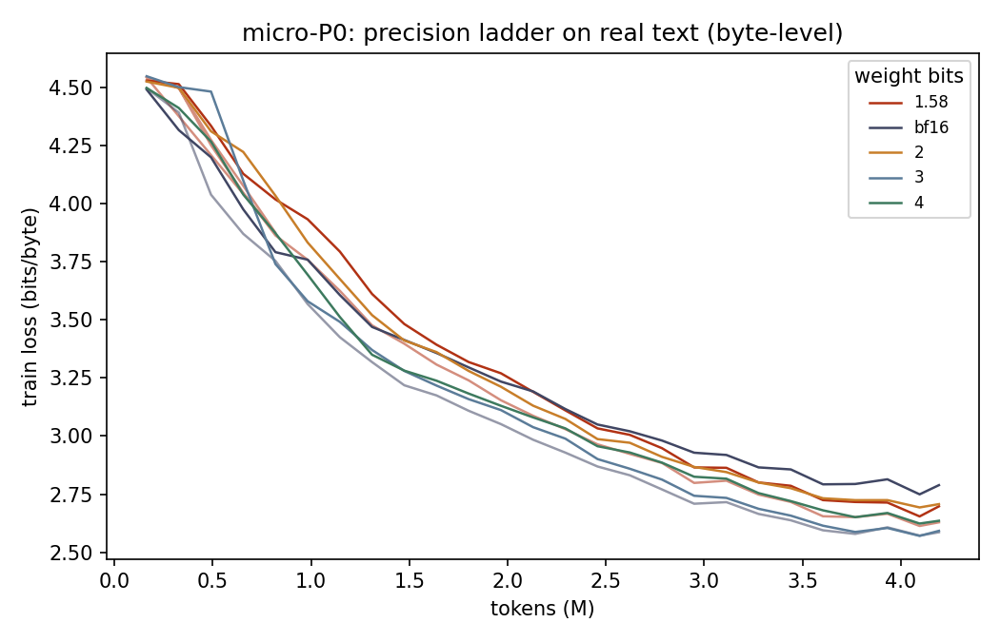

# Research Note 0 — micro-P0: end-to-end replication of the ternary-vs-bf16 training dynamic at 4.7M parameters

*LOGOS project · August 5, 2026 · status: complete, panel-verified*

## Purpose

Before any scaling-law claim, the plan (v0.2 §5 / v0.3 L0) requires proof
that the stack — quantizers, trainer, evaluator, exporter — reproduces the
*known* qualitative result on which the project builds: natively-trained
ternary models track full-precision models closely when undertrained, with
the gap opening only as tokens/param grows (Ouyang et al. 2024; BitNet
b1.58). micro-P0 is that proof at the smallest useful scale, run entirely on
an RTX 3080, on real text, through every stage of the pipeline the real grid
will use: manifest → deterministic data → training → BPB eval → packed
export → parity gate → results store → validation panel.

## Setup

| | |
|---|---|
| Model | `micro` ladder rung: d=256, 6 layers, GQA 4:1, SwiGLU, 4.72M non-emb params |
| Corpus | *Frankenstein* (Project Gutenberg), **byte-level** tokens (vocab 256), so BPB is exact by construction (1 token = 1 byte) |
| Splits | contiguous 90/5/5: train 404,036 tokens · val1 22,446 · val2 22,447 (disjointness verified from the binary data by the panel) |
| Training | 4.19M tokens (D/N ≈ 0.87 — deliberately *undertrained*), seq 256, batch 16,384 tok, cosine LR, bf16 autocast |
| Arms | {1.58, 2, 3, 4, bf16}-bit weights; WxA8 activations on quantized arms; identical master-weight init per seed; identical data order (`data_seed=1337`) |
| Seeds | 2 × {ternary, bf16} (the headline pair), 1 × {2, 3, 4} |

## Results

**Validation bits-per-byte (val1), final:**

| Arm | seed 0 | seed 1 | mean | σ | packed body bytes |
|-----|--------|--------|------|---|-------------------|
| 1.58-bit | 2.7052 | 2.6607 | **2.6830** | 0.0315 | 1,355,176 |
| 2-bit | 2.7329 | — | 2.7329 | — | 1,545,472 |
| 3-bit | 2.6302 | — | 2.6302 | — | 2,147,584 |
| 4-bit | 2.6710 | — | 2.6710 | — | 2,749,696 |
| bf16 | 2.7950 | 2.5982 | **2.6966** | 0.1392 | 9,771,520 |

**Findings.**

1. **The undertrained-regime dynamic reproduces.** At D/N ≈ 0.87, ternary is
   statistically indistinguishable from bf16 (gap −0.014 BPB against a 2σ
   bar of 0.278) while its packed body is **7.2× smaller**. End-of-training
   *train*-loss ordering was 3b < 4b < 1.58b < 2b < bf16 — full precision
   *worst*, exactly the inversion the literature predicts this early in
   training. The main grid's job (L1–L2) is to map where and how fast this
   reverses as D/N → 320×.
2. **Seed noise is the binding constraint at tiny scale.** bf16's two seeds
   differ by 0.20 BPB (σ = 0.139) — 10× the ternary σ. This is exactly why
   the plan requires 3 seeds at the smallest grid sizes and forbids claiming
   any gap below 2σ. No cross-precision ordering among {2, 3, 4}-bit single
   seed arms is claimed here.
3. **The export path is exact.** Every arm's packed artifact reloads to
   bitwise-identical quantized codes and scales (panel-verified with an
   independent bit-stream decoder), with logit KL ≤ 3×10⁻⁴.

## What this note does NOT claim

- No scaling-law parameters (one size, one D/N point, a 400KB corpus).
- No downstream-task claims (byte-level micro models don't benchmark).
- No cross-precision quality ordering beyond the 2σ-gated ternary/bf16 pair.

## Two methodological findings worth recording

**(a) Max-abs logit difference is not a valid export-parity criterion for
deep quantized models.** The reloaded ternary model recomputes its absmean
scale as an fp32 mean — ulp-level different from the original. The int8
activation quantizer is discontinuous, so that ~10⁻⁶ seed difference
amplifies layer by layer (measured 5×10⁻⁶ after block 0 → 0.15 after block
5) into ~0.05–0.09 max-abs logit drift while the distributions stay
essentially identical (KL ≈ 3×10⁻⁴). The parity gate was therefore defined
as *bitwise packed codes/scales equality* plus a KL bound, with max-abs
reported but non-gating. Anyone building QAT export pipelines will hit this.

**(b) Kill-and-resume must be tested on-device.** The CPU resume test
passed while the CUDA path was broken (`torch.load(map_location="cuda")`
moves RNG ByteTensors to GPU where `set_rng_state` rejects them). Found the
first time a real GPU run resumed; the fixed path is now covered by the
panel's resume gate, which requires *bit-exact* continuation.

## Provenance

Manifest `manifests/p0local.yaml` · results `results/results.jsonl` (rows
carry science-field config hashes cross-checked against the manifest) ·
runs `runs/local_p0/` · verified by panel round 1 (all 11 probes ACCEPT):
[validation-panel-round-1.md](validation-panel-round-1.md).
