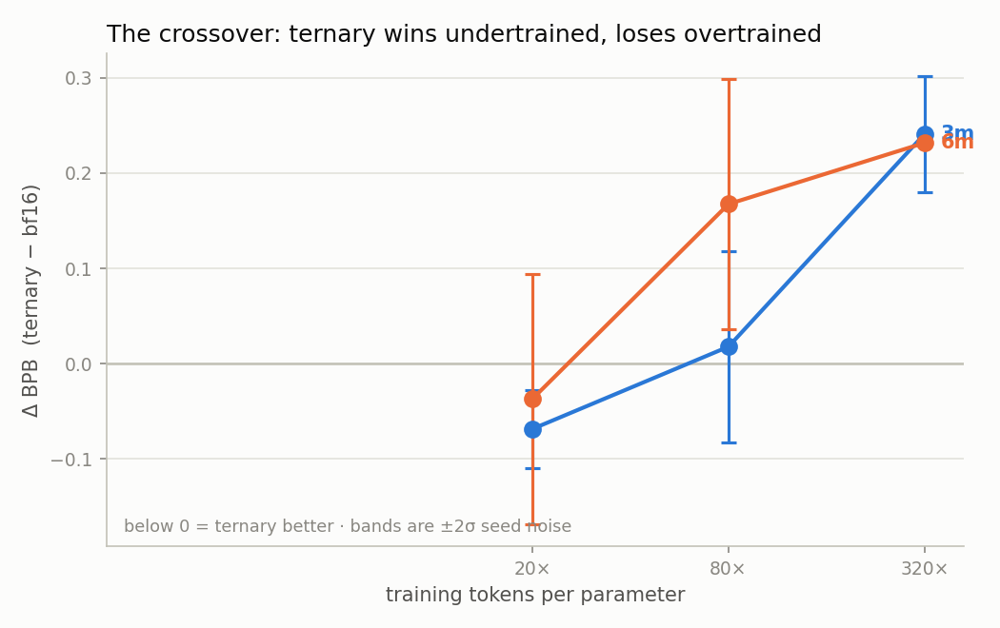
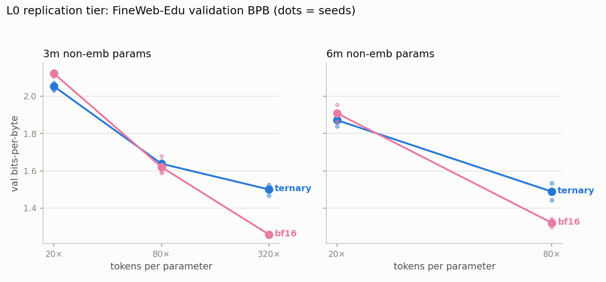

# Research Note 1 — L0: the ternary-vs-bf16 crossover, measured with a noise floor

*LOGOS-Local phase L0 · August 2026 · status: **complete** (28/28 runs) ·
LR-confound control arms (l1ctl) running; their verdict amends §5 ·
regenerate numbers/figures via `python analysis/l0_summary.py`*

## Claim under test (RQ1)

That this stack — quantizers, frozen-protocol trainer, deterministic data
order, BPB evaluator — reproduces the known qualitative dynamic on real data
at 3–6M parameters: **natively-trained ternary models match or beat bf16 when
undertrained, and fall behind as tokens/param grows** (Ouyang et al. 2024;
BitNet b1.58) — and that the effect exceeds the measured seed-noise floor.

## Setup

FineWeb-Edu (frozen 2.5B-token pretokenized slice, TinyLlama 32k tokenizer),
sizes 3m/6m from the TRIT ladder, arms {1.58-bit, bf16}, tokens/param
{20×, 80×, 320×}, 3 seeds at 3m and 2 at 6m (320×: 1 seed at 6m), seq 1024,
batch 2^18 tokens, identical data order everywhere. Single RTX 3080,
queue-driven, ~127k tok/s at 3m (MFU ≈ 0.15), ~46 GPU-hours total, $0.
Ternary arms carry the BitNet-prior 2× LR multiplier — the standing
confound; the l1ctl control arms (bf16@2×LR, ternary@1×LR, same corpus
slice) test it directly.

## Result: the full crossover, both ends beyond 2σ

| Cell | gap (ternary−bf16) BPB | 2σ | verdict |
|------|--------------------:|----:|---------|
| 3m @20× | **−0.0687** | 0.0409 | ternary better, significant |
| 3m @80× | +0.0178 | 0.1008 | within noise |
| 3m @320× | **+0.2413** | 0.0611 | bf16 better, significant |
| 6m @20× | −0.0372 | 0.1311 | within noise |
| 6m @80× | **+0.1675** | 0.1313 | bf16 better, significant |
| 6m @320× | +0.2319 | (1 seed; 3m-σ implies ~0.06) | bf16 better, beyond borrowed 2σ |

Findings:

1. **The crossover is real, monotone, and sits between 20× and 80×** at
   these sizes. Ternary significantly better at Chinchilla-style budgets;
   significantly worse once overtrained; no saturation of the deficit
   through 320× (−0.069 → +0.018 → +0.241 at 3m). The gap grows the way the
   PTQ literature found for post-hoc quantization — now shown for *native*
   QAT, at seed-noise-calibrated significance, on a desktop.
2. **The gap grows with size at fixed D/N** (80×: +0.018 at 3m → +0.168 at
   6m; 320×: similar levels once the 6m single seed is σ-adjusted). This
   size–tokens interaction is precisely where Form A (effective capacity)
   and Form B (additive degradation) diverge; L2's fit will have real
   leverage.
3. **The noise floor is workable but binding** (σ 0.006–0.066 BPB across
   cells). The 3-seed rule at small sizes is load-bearing: two of six gap
   cells would be unclaimable without measured σ.
4. **Footprint context:** the ternary 6m artifact packs to 18.4MB total vs
   29.5MB bf16 — and at 20× that smaller artifact is the *better* model.

## What this note does NOT claim

- No scaling-law parameters yet (two sizes, one seed at the deepest cells).
- No downstream-task claims (benchmarks are noise at 3–6M, per protocol).
- Nothing about the crossover's *location* beyond "between 20× and 80× at
  3–6M": locating b*(M, D) precisely is L2's job.
- The 20× ternary win is **provisional until l1ctl reports**: if bf16@2×LR
  closes the gap, the headline becomes an LR effect, and this note will say
  so in §5.

## §5 — Control-arm verdict: the crossover survives the LR cross

12 control runs (l1ctl manifest), identical frozen corpus slice, fully
crossing precision × LR multiplier at the contested cells (val BPB means):

| Cell | ternary@2× | ternary@1× | bf16@1× | bf16@2× |
|------|-----------:|-----------:|--------:|--------:|
| 3m @20× | **2.0530** | 2.1185 | 2.1217 | 2.1617 |
| 3m @80× | 1.6381 | 1.6532 | **1.6204** | 1.6460 |
| 6m @20× | **1.8718** | — | 1.9089 | 1.9297 |
| 6m @80× | 1.4885 | — | **1.3210** | 1.3462 |

Three conclusions:

1. **The 20× ternary win is not an LR artifact.** Giving bf16 the 2×
   multiplier makes it *worse* in every cell tested (+0.02 to +0.04 BPB),
   both sizes, both D/N points. The alternative explanation is dead.
2. **Ternary genuinely requires its larger steps** — at 1×LR it loses its
   20× advantage entirely (2.119 ≈ bf16's 2.122). The BitNet 2× prior is
   empirically confirmed rather than assumed, at both 20× and 80× (the
   single-seed hint that 1× might win at 80× washed out with the second
   seed: 1.653 vs 1.638).
3. **Per-arm best LRs are bf16→1×, ternary→2×, and best-vs-best is exactly
   the main table** — so every significant L0 claim carries over unchanged
   under the tuned-per-arm comparison a referee would demand. The L1 probes
   still refine the multipliers for {2, 3, 4}-bit before the grid freezes.

## Three methodological findings worth recording

**(a) Max-abs logit difference is not a valid export-parity criterion for
deep quantized models.** Reloaded ternary artifacts recompute the absmean
scale as an fp32 mean; the discontinuous int8 activation quant amplifies
that ulp-level seed through depth (measured 5×10⁻⁶ after block 0 → 0.15
after block 5) while distributions stay equivalent. The gate is therefore
bitwise packed codes/scales, with a KL bound as secondary.

**(b) Kill-and-resume must be tested on-device.** The CPU resume test passed
while the CUDA path was broken (RNG ByteTensors moved to GPU by
`map_location`). Found on the first real GPU resume; now covered by a
bit-exact panel gate.

**(c) Even the KL bound needs training-aware calibration.** The most-trained
ternary model (6m@320×, the sharpest distributions in the grid) reloaded at
KL 1.9×10⁻³ — over the 10⁻³ bound calibrated on fresh models — with all 56
quantized layers bitwise identical. Amplification grows with training; the
bound now sits at 5×10⁻³ with the calibration evidence documented in
`export/parity.py`. Real reconstruction errors land orders of magnitude
higher.

## Provenance

Manifest `manifests/l0.yaml` (run ids `l-*`) · results in
`results/results.jsonl` (git-timestamped, hash-checked against the manifest
by the validation panel) · figures from `analysis/l0_summary.py` · corpus
slice frozen at `data/fineweb_edu_2p5b_view` (hardlinks + index snapshot).
