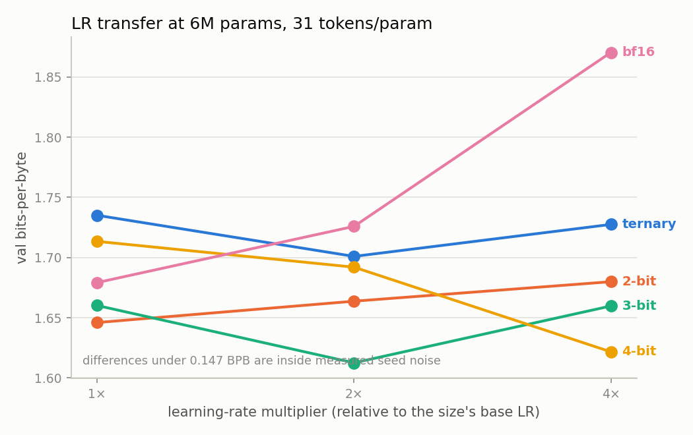

# Research Note 2 — L1: freezing the protocol (LR rule, FFN choice) and the gap study

*LOGOS-Local phase L1 · August 2026 · status: **in progress** — §1 (LR
transfer) complete pending the bracket extension; §2 (FFN) and §3 (gap
study) land as their runs complete · regenerate via
`python analysis/lr_probe_summary.py`*

L1 exists to remove the researcher degrees of freedom before the grid runs.
Two knobs get frozen here for the rest of the project — the per-precision
learning-rate multiplier and the FFN nonlinearity — and one novel figure
comes out: how the low-bit quality gap evolves with tokens/param at a fixed
size (RQ2).

## §1 — LR transfer: quantized training is markedly less LR-sensitive than bf16

15 probes at 6M params, 200M tokens (~31 tokens/param), one seed each,
multipliers {1×, 2×, 4×} on each precision's base LR.



| arm | 1× | 2× | 4× | spread | argmin |
|-----|----:|----:|----:|-------:|--------|
| ternary | 1.7351 | **1.7010** | 1.7275 | 0.034 | 2× |
| 2-bit | **1.6460** | 1.6637 | 1.6799 | 0.034 | 1× (edge) |
| 3-bit | 1.6601 | **1.6125** | 1.6597 | 0.048 | 2× |
| 4-bit | 1.7134 | 1.6920 | **1.6216** | 0.092 | 4× (edge) |
| bf16 | **1.6792** | 1.7259 | 1.8705 | **0.191** | 1× (edge) |

**The headline is the spread column.** Across a 4× LR range, full precision
moves 0.19 BPB while ternary and 2-bit move 0.034 — a 5–6× difference in
sensitivity. This is mechanically sensible: the weight quantizer is a
projection, so a larger optimizer step maps to a much smaller change in the
*effective* (quantized) weights; the same property that makes low-bit
training awkward to optimize also makes it forgiving of a mistuned LR.
Practically, it means a native low-bit run is cheaper to get right — you do
not have to find the LR, you have to avoid the cliff, and the cliff is
further away. (Measured at one size and one D/N point; L2 will show whether
it holds across the ladder.)

**The methodological catch.** Three of five argmins sit **on an edge of the
probe grid** — bf16 and 2-bit at the bottom, 4-bit at the top — which means
those optima are not bracketed and a frozen rule read off this table would
be an assumption dressed as a measurement. The bf16 case is the dangerous
one: if full precision actually wants < 1×, then bf16 has been handicapped
in every comparison in this project so far and the ternary advantage at 20×
is inflated. That would not be caught by the L0 control arms, which tested
bf16 at 2× (worse) but never below 1×.

So the grid is being extended before anything freezes (`manifests/l1lrx.yaml`,
12 runs, ~23 GPU-h): every arm at 0.5×, bf16 and 2-bit also at 0.25×, 4-bit
at 8×, plus two extra seeds on the 4-bit 2×-vs-4× comparison — the largest
difference in the table that is still inside the noise bar.

**Noise discipline.** Measured seed σ at 6M is 0.0519 BPB, so two
single-seed runs differ significantly only beyond 0.147 BPB. By that bar,
*none* of the quantized arms' multiplier differences are significant, and
only bf16's 1×-vs-4× (0.191) is. The freeze rule is therefore: **deviate
from the prior only on significant evidence** — priors bf16→1× and
quantized→2× (BitNet b1.58), the latter already confirmed for ternary by
the L0 control arms at 2 seeds × 2 D/N points. Provisional frozen rule,
pending the bracket runs:

```yaml
bf16: 1.0    # significantly hurt at 4x; bracketed from below by l1lrx
"4":  2.0    # argmin 4x is +0.070, inside the 0.147 bar; tie-break running
"3":  2.0
"2":  2.0
"1.58": 2.0  # confirmed significant vs 1x by the l1ctl controls
```

## §2 — FFN ablation (pending)

*SwiGLU vs squared-ReLU at 12M ternary, 20× and 80×; winner frozen for
every arm.*

## §3 — The gap study (in progress)

12M params, all five precisions, 20× / 80× / 320×. First cell complete
(20×, one seed each):

| arm | val BPB | vs bf16 |
|-----|--------:|--------:|
| 2-bit | 1.4945 | −0.104 |
| 4-bit | 1.4955 | −0.103 |
| 3-bit | 1.5153 | −0.083 |
| ternary | 1.5201 | −0.078 |
| bf16 | 1.5982 | — |

At 20 tokens/param **every quantized arm beats full precision** at 12M —
the L0 crossover result, now across the whole precision ladder rather than
just the ternary/bf16 pair. Ordering among the quantized arms is inside
single-seed noise and is not claimed. The 80× and 320× rows will show
whether they all cross together or in bit order — the latter would be the
first direct evidence for a precision-dependent crossover location, which
is what the fitted law has to reproduce.

## Provenance

Manifests `l1.yaml`, `l1lrx.yaml`, `l1ctl.yaml` · results in
`results/results.jsonl` (git-timestamped, hash-checked against manifests) ·
figures from `analysis/lr_probe_summary.py` and `analysis/l0_summary.py`.
